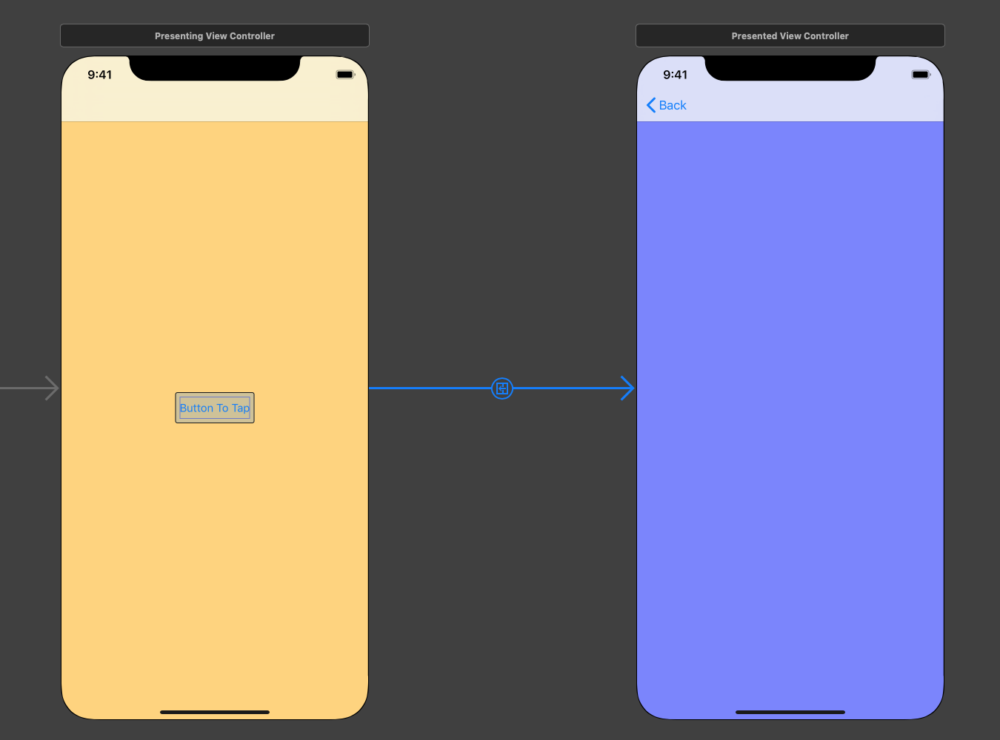

# Button Segue

Example of unit testing a segue which is initiated by a button on one view 
controller (called the PresentingViewController) to a second view controller 
(called the PresentedViewController) - as illustrated in the following figure:

For this type of segue, the following aspects should be tested:
- There is an outlet hooked up for the button. This tests we have a button.
- The button is connected to an action. This tests the button is connected to the segue.
- The segue has an identifier. The specific text of the identifier is not important, however, it must exist if it is going to be used on the `prepare(for segue: UIStoryboardSegue, sender: Any?)` method of the `PresentingViewController`.
- Tapping the button causes the `PresentingViewController` to presents the `PresentedViewController`. This tests the segue is connected to the `PresentedViewController` (and not some other object). 
- When the button is tapped, some model data is passed from the `PresentingViewController` to the `PresentedViewController`. This tests the method  `prepare(for segue: UIStoryboardSegue, sender: Any?)` is performing the required functionaility.
